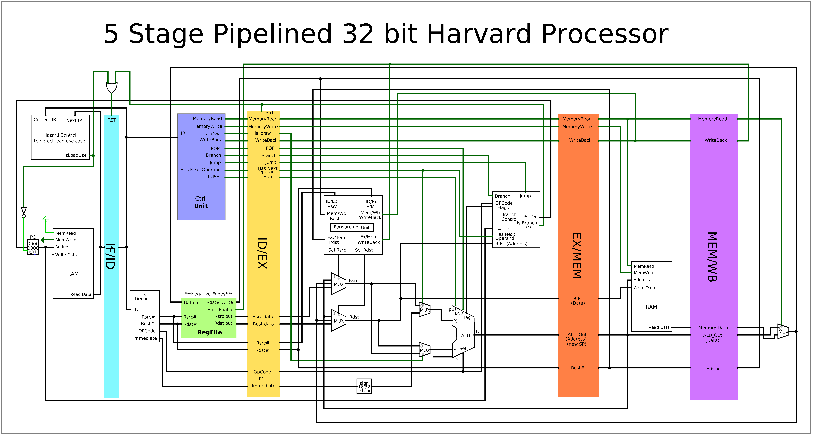

# Pipelined Processor
## This is a 32-bit 5 stage pipelined processor using Harvard Architecture 

# Features
* 8 General Purpose Registers (32 bit each)
* Reduces Data Hazards using Data Forwarding
* Detect and stall Load-Use Case
* Static Branch Detection
* Using Harvard Architecture to Eliminate Structural Hazard on Memory

# Stages

### Consists of 5 stages:
| Instruction Fetch (IF) | Instruction Decode (ID) | Execute (Ex) | Memory (Mem) | Write Back (WB) |
|:-:|:-:|:-:|:-:|:-:|

# Design

# IR Format
### OPCode (9 bits)
<table>
  <tr>
    <td>Has Next Operand</td>
    <td>Memory Read</td>
    <td>Memory Write</td>
    <td>Register Write Back</td>
    <td>Actual OpCode</td>
  </tr>
  <tr>
    <td>1 Bit</td>
    <td>1 Bit</td>
    <td>1 Bit</td>
    <td>1 Bit</td>
    <td>5 Bits</td>
  </tr>
</table>

### Actual OpCode
<table>
  <tr>
    <td>1op</td>
    <td>0</td>
    <td>OP</td>
    <td>OP</td>
    <td>OP</td>
    <td>OP</td>
  </tr>
  <tr>
    <td>2op</td>
    <td>1</td>
    <td>0</td>
    <td>OP</td>
    <td>OP</td>
    <td>OP</td>
  </tr>
  <tr>
    <td>branch</td>
    <td>1</td>
    <td>1</td>
    <td>OP</td>
    <td>OP</td>
    <td>OP</td>
  </tr>
</table>

### IR Format

| Control_Signals | OPCode | Rsrc | Rdst | 0 |
|:---------------:|:------:|:----:|:----:|:-:|
|       0000      | 00000  | 000  | 000  | 0 |

# Instruction Set
### One Operand

<table>
  <tr>
    <td>Mnemonic</td>
    <td>Function</td>
    <td>OpCode</td>
  </tr>
  <tr>
    <td>NOP</td>
    <td>No Operation</td>
    <td>0000 0 0000 # 0</td>
  </tr>
  <tr>
    <td>SETC</td>
    <td>Set Carry</td>
    <td>0000 0 0001 # 1</td>
  </tr>
  <tr>
    <td>CLRC</td>
    <td>Clear Carry</td>
    <td>0000 0 0010 # 2</td>
  </tr>
  <tr>
    <td>CLR Rdst</td>
    <td>Sets Rdst to zeros</td>
    <td>0001 0 0011 # 3</td>
  </tr>
  <tr>
    <td>NOT  Rdst</td>
    <td>NOT value stored in register Rdst
     Rdst ← 1’s Complement(Rdst) </td>
    <td>0001 0 0100 # 4</td>
  </tr>
  <tr>
    <td>INC  Rdst</td>
    <td>Increment value stored in  Rdst</td>
    <td>0001 0 0101 # 5</td>
  </tr>
  <tr>
    <td>DEC  Rdst</td>
    <td>Decrement value stored in  Rdst</td>
    <td>0001 0 0110 # 6</td>
  </tr>
  <tr>
    <td>NEG  Rdst</td>
    <td>Negate the value stored in register Rdst
     Rdst ← 2’s Complement(Rdst) </td>
    <td>0001 0 0111 # 7</td>
  </tr>
  <tr>
    <td>OUT  Rdst</td>
    <td>OUT.PORT ← Rdst</td>
    <td>0000 0 1000 # 8</td>
  </tr>
  <tr>
    <td>IN  Rdst</td>
    <td>Rdst ←IN.PORT</td>
    <td>0001 0 1001 # 9</td>
  </tr>
  <tr>
    <td>RLC  Rdst</td>
    <td>Rotate left  with carry</td>
    <td>0001 0 1010 # 10</td>
  </tr>
  <tr>
    <td>RRC  Rdst</td>
    <td>Rotate right with carry</td>
    <td>0001 0 1011 # 11</td>
  </tr>
  <tr>
    <td>PUSH  Rdst</td>
    <td>Mem[SP] ← Rdst
     SP -= 2</td>
    <td>0010 0 1100 # 12</td>
  </tr>
  <tr>
    <td>POP  Rdst</td>
    <td>SP += 2
      Rdst ← Mem[SP]; </td>
    <td>0101 0 1101 # 13</td>
  </tr>
</table>
  
 
### Two Operands

Imm	= Immediate Value (16 bits)

<table>
  <tr>
    <td>Mnemonic</td>
    <td>Function</td>
    <td>OpCode</td>
  </tr>
  <tr>
    <td>ADD Rsrc, Rdst</td>
    <td>Rdst + Rsrc</td>
    <td>0001 10 000 # 0</td>
  </tr>
  <tr>
    <td>SUB  Rsrc, Rdst</td>
    <td>Rdst - Rsrc</td>
    <td>0001 10 001 # 1</td>
  </tr>
  <tr>
    <td>AND  Rsrc, Rdst</td>
    <td>Rdst AND Rsrc</td>
    <td>0001 10 010 # 2</td>
  </tr>
  <tr>
    <td>OR  Rsrc, Rdst</td>
    <td>Rdst OR Rsrc</td>
    <td>0001 10 011 # 3</td>
  </tr>
  <tr>
    <td>IADD Rdst,Imm</td>
    <td>Rdst + Imm</td>
    <td>1001 10 000 # 0 
     Same as Add but "Has Next Operand" is true</td>
  </tr>
  <tr>
    <td>MOV Rsrc, Rdst</td>
    <td>Move value from register Rsrc to register Rdst</td>
    <td>0001 10 100 # 4</td>
  </tr>
  <tr>
    <td>SHL Rsrc, Imm</td>
    <td>Shift left Rsrc by #Imm bits and store result in same register</td>
    <td>1001 10 101 # 5</td>
  </tr>
  <tr>
    <td>SHR Rsrc, Imm</td>
    <td>Shift right Rsrc by #Imm bits and store result in same register</td>
    <td>1001 10 110  # 6</td>
  </tr>
</table>

### Memory Operations
Offset = Address offset (16 bits)
 Imm	= Immediate Value (16 bits)
<table>
  <tr>
    <td>Mnemonic</td>
    <td>Function</td>
    <td>OpCode</td>
  </tr>
  <tr>
    <td>LDM  Rdst, Imm</td>
    <td>Load immediate value (16 bit) to register Rdst
     Rdst ← Imm</td>
    <td>1001 10 100 # 4 
     OpCode of MOV but “Has Next Operand” is true</td>
  </tr>
  <tr>
    <td>LDD  Rdst, offset(Rsrc)</td>
    <td>Load value from memory address Rsrc + offset to register Rdst
     Rdst ← Mem[Rsrc + offset]</td>
    <td>1101 10 000 # 0 
     OpCode of Add</td>
  </tr>
  <tr>
    <td>STD Rsrc1, offset(Rsrc2)</td>
    <td>Store value that is in register  Rsrc1 to memory location Rsrc2 + offset
     M[Rsrc2 + offset] ←Rsrc1</td>
    <td>1010 10 000 # 0 
     OPCode of Add</td>
  </tr>
</table>

### Branch Operations

<table>
  <tr>
    <td>Mnemonic</td>
    <td>Function</td>
    <td>OpCode</td>
  </tr>
  <tr>
    <td>JZ  Rdst</td>
    <td>Jump to address in Rdst if zero</td>
    <td>0000 11 001 # 1</td>
  </tr>
  <tr>
    <td>JN  Rdst</td>
    <td>Jump to address in Rdst if negative </td>
    <td>0000 11 010 # 2</td>
  </tr>
  <tr>
    <td>JC Rdst</td>
    <td>Jump to address in Rdst if negative </td>
    <td>0000 11 011 # 3</td>
  </tr>
  <tr>
    <td>JMP  Rdst</td>
    <td>PC ← Rdst</td>
    <td>0000 11 000 # 0</td>
  </tr>
</table>
